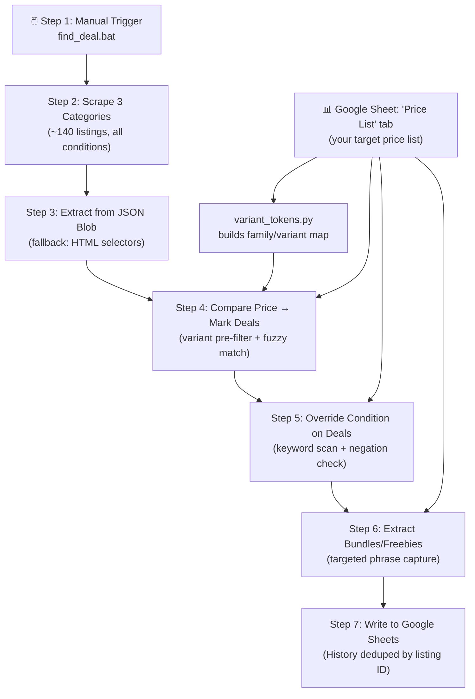

# Carousell Deal Finder — Implementation Plan (v4)

> Revised again: adds an auto-generated variant-token pre-filter, negation-aware condition scanning, targeted freebie extraction, listing-ID dedup on History, and a rapidfuzz swap.

---
# Important Variables

Credentials are kept in the local service-account configuration and are never
stored in this repository or in project documentation.


## Revised Pipeline



### Step-by-Step Detail

#### Step 1 — Manual Trigger
- Double-click `find_deal.bat` or run `python deal_finder.py`
- No scheduling, no automation — always manual

#### Step 2 — Scrape 3 Categories (~140 listings)
- Fetch all 3 category pages (sorted by Recent):
  - `https://www.carousell.ph/categories/video-gaming-884/?sort_by=3`
  - `https://www.carousell.ph/categories/mobile-phones-gadgets-840/?sort_by=3`
  - `https://www.carousell.ph/categories/computers-tech-838/?sort_by=3`
- Collects ALL conditions (Brand new, Like new, Lightly used, Well used, Heavily used)
- ~48 listings per category = ~144 total limit
- 2-3 second delay between category fetches

#### Step 3 — Extract from JSON Blob (or Fallback)
- **Primary:** Parse the embedded JSON blob → `SearchListing.listingCards` (48 items)
- **Fallback:** HTML selectors (`data-testid=listing-card-X`) if JSON blob not found
- Extract per listing: `title`, `price`, `condition`, `description`, `link`, `seller`
- Normalize price: `"PHP 15,000"` → `15000.0`

**Error handling (new):** if *both* the JSON blob and the HTML fallback come back empty, raise a `ScraperStructureError` and abort the whole pipeline before Steps 4-7 run — this prevents a broken scrape from overwriting yesterday's good sheet data with nothing.

```python
class ScraperStructureError(Exception):
    """Raised when neither the JSON blob nor HTML fallback can find listings."""
    pass

def scrape_category(url):
    listings = extract_from_json_blob(url)
    if not listings:
        listings = extract_from_html_fallback(url)
    if not listings:
        raise ScraperStructureError(
            f"Failed to retrieve deals from Carousell. Update needed for the structure. (URL: {url})"
        )
    return listings

# deal_finder.py
try:
    listings = scrape_all_categories()
except ScraperStructureError as e:
    print(f"❌ {e}")
    logging.error(str(e))
    sys.exit(1)
```

#### Step 3.5 (NEW) — Build Variant Token Map (`variant_tokens.py`)
- Runs automatically at the start of `deal_engine.py` (imported, not a manual step) — reads the `Item Name` column from the `Price List` tab in the `deal_finder` Google Sheet.
- Groups reference items into "families" by fuzzy similarity (e.g. `PS5 Slim` + `PS5 Slim Digital`; `iPhone 15` + `iPhone 15 Pro Max`), then derives each family member's **distinguishing tokens** — the words that separate variants (`digital`, `pro`, `max`, `oled`, `2`).
- Output is an in-memory dict, rebuilt fresh every run — not cached to disk, so it always reflects your current Google Sheet data and never goes stale. Keeps this logic out of `deal_engine.py` entirely.

```python
# variant_tokens.py
from rapidfuzz import fuzz

def group_families(item_names, threshold=55):
    """Cluster reference item names into families by string similarity."""
    families, used = [], set()
    for i, name in enumerate(item_names):
        if name in used:
            continue
        family = [name]
        used.add(name)
        for other in item_names[i + 1:]:
            if other not in used and fuzz.token_sort_ratio(name.lower(), other.lower()) >= threshold:
                family.append(other)
                used.add(other)
        families.append(family)
    return families

def build_variant_token_map(item_names):
    """Return {item_name: set(distinguishing_tokens)} for use as a pre-filter gate."""
    token_map = {}
    for family in group_families(item_names):
        if len(family) == 1:
            token_map[family[0]] = set()  # unique family, no filtering needed
            continue
        token_sets = {name: set(name.lower().split()) for name in family}
        base_tokens = set.intersection(*token_sets.values())
        for name, tokens in token_sets.items():
            token_map[name] = tokens - base_tokens
    return token_map
```

```python
# used inside deal_engine.py
def filter_candidates(listing_title, item_name, variant_map, reference_items):
    title_tokens = set(listing_title.lower().split())
    my_tokens = variant_map.get(item_name, set())
    other_family_tokens = {
        t for other, toks in variant_map.items()
        if other != item_name and toks and toks != my_tokens
        for t in toks
    }
    if not my_tokens:
        return True  # no distinguishing tokens = unique family, nothing to gate
    has_mine = my_tokens.issubset(title_tokens)
    has_others = bool((other_family_tokens - my_tokens) & title_tokens)
    return has_mine and not has_others
```

> Note: the fuzzy-similarity threshold (55) that decides what counts as a "family" is a judgment call — worth spot-checking once your item list grows past ~15-20 entries, since two unrelated items with a similar name pattern could get grouped incorrectly.

#### Step 4 — Compare Price → Mark as "Deal"
- Read `Price List` tab from the connected `deal_finder` Google Sheet
- Restrict candidates using the Step 3.5 variant map, **then** fuzzy-match the (filtered) title against `Item Name` using `rapidfuzz`
- If match confidence > 60% AND listing price ≤ `Deal Price` → mark as **DEAL ✅**
- If no match found → skip (not tracked = not a deal)

#### Step 5 — Override Condition (Only on Deals)
- Only runs on items already marked as "Deal"
- Reads `Keyword for Condition Downsizing` column
- Scans description for those keywords, **skipping any match preceded by a negation word within a 4-word window** (`no`, `not`, `without`, `never`, `isn't`, `wasn't`, `hasn't`, `none`) so "no issues at all" doesn't trigger a downgrade
- Override rules unchanged from v3:

```
Original Condition + Keyword Found → Overridden To
─────────────────────────────────────────────────────
Brand new       + "issue"         → Lightly used
Like new        + "replaced"      → Well used
Lightly used    + "defective"     → Well used
Well used       + (anything)      → Well used (NO CHANGE)
Heavily used    + (anything)      → Heavily used (NO CHANGE)
```

```python
NEGATION_WORDS = {"no", "not", "without", "never", "isn't", "wasn't", "hasn't", "none"}

def is_negated(desc_lower, keyword, window=4):
    idx = desc_lower.find(keyword)
    if idx == -1:
        return False
    preceding = desc_lower[:idx].split()[-window:]
    return any(neg in preceding for neg in NEGATION_WORDS)

def override_condition(original_condition, description, downsizing_keywords):
    if not downsizing_keywords:
        return original_condition, False
    desc_lower = description.lower()
    for keyword in downsizing_keywords:
        keyword = keyword.strip().lower()
        if keyword and keyword in desc_lower and not is_negated(desc_lower, keyword):
            new_condition = DOWNSIZE_MAP.get(original_condition, original_condition)
            if new_condition != original_condition:
                return new_condition, True
    return original_condition, False
```

#### Step 6 — Extract Bundles/Freebies (targeted, not whole-line)
- Reads `Keyword for Finding Freebies` column
- Instead of grabbing the whole matching sentence, capture only the phrase immediately following the trigger, up to a comma/period/newline — filters out unrelated description text you don't care about

```python
import re

FREEBIE_PATTERNS = [
    r"comes with\s+([^,.\n]+)",
    r"includes?\s+([^,.\n]+)",
    r"free\s+([^,.\n]+)",
    r"bundled with\s+([^,.\n]+)",
]

def extract_freebies(description, keyword_phrases):
    found = []
    desc_lower = description.lower()
    for pattern in FREEBIE_PATTERNS:
        trigger = pattern.split(r"\s+")[0].replace(r"\s", " ")
        if not any(trigger in kw.lower() for kw in keyword_phrases):
            continue
        for match in re.finditer(pattern, desc_lower, re.IGNORECASE):
            item = match.group(1).strip()
            if len(item.split()) <= 6:
                found.append(item)
    return list(dict.fromkeys(found))
```

> **Future enhancement, not part of MVP:** once you have a few weeks of scraped descriptions saved, it'd be possible to mine that corpus for freebie phrasing and negation cues you haven't thought to add manually — e.g. frequency-counting the words/phrases that show up right before your trigger words across many listings, or using a proper NLP negation detector (the `negspacy` library, built on top of spaCy, flags negated terms using real dependency grammar instead of a word-window guess) instead of the simple heuristic above. Neither is needed for the MVP — flagging as a later refinement once you have real data to mine.

#### Step 7 — Write to Google Sheets
- `Current Deals` tab → overwritten each run (only items marked DEAL)
- `All Listings` tab → overwritten each run (everything scraped)
- `History` tab → append-only, **now deduped by listing ID**

**Dedup logic (new):**
- Parse a stable listing ID from the Carousell URL: `re.search(r"-(\d+)/?$", link)`
- Before writing, load existing `History` listing IDs into a set
- If a deal's listing ID is already present → update that row's `Last Seen Date` in place instead of appending
- If new → append with `First Seen Date` and `Last Seen Date` both set to today

```python
def get_listing_id(link):
    match = re.search(r"-(\d+)/?$", link)
    return match.group(1) if match else link
```

---

## Google Sheet Input Tab: `Price List`

*(Replaces local `reference_prices.xlsx` — now stored directly as a tab in your connected `deal_finder` Google Sheet)*

This tab serves as your single source of truth for target items, deal thresholds, and keyword rules. You can edit it directly in your browser or phone without needing Microsoft Excel on your computer.

### Columns in `Price List` tab:
| Item Name | Category | Retail Price (PHP) | Deal Price (PHP) | Keyword for Condition Downsizing | Keyword for Finding Freebies | Notes |
|---|---|---|---|---|---|---|
| PS5 Slim | Video Gaming | 30000 | 18000 | issue, defect, replaced | comes with, free, includes | Target disc version |
| PS5 Slim Digital | Video Gaming | 26000 | 16000 | issue, defect, replaced | comes with, free, includes | Digital only |
| Nintendo Switch OLED | Video Gaming | 16000 | 10000 | drift, scratch, repair | free, includes, bundle | |
| iPhone 15 | Mobile Phones | 45000 | 28000 | bypass, issue, scratch | case, charger, free | |
| iPhone 15 Pro Max | Mobile Phones | 70000 | 45000 | bypass, crack, issue | case, free, bundle | |
| iPad Air 5 | Computers & Tech | 35000 | 22000 | crack, dent, issue | pencil, folio, free | |
| M1 MacBook Air | Computers & Tech | 42000 | 25000 | battery, issue, dent | charger, bag, free | 8GB/256GB base |
| Sony WH-1000XM5 | Computers & Tech | 18000 | 10000 | pad, issue, replaced | case, cable, free | |

---

## Google Sheet Output Layout

### Tab: `Current Deals` (overwritten each run)
*(unchanged from v3)*

### Tab: `All Listings` (overwritten each run)
*(unchanged from v3)*

### Tab: `History` (append-only, deduped by listing ID)

| Listing ID | Item Name | Listing Title | Carousell Price | Deal Price | Savings | Final Condition | Bundles | Category | Link | First Seen Date | Last Seen Date |
|---|---|---|---|---|---|---|---|---|---|---|---|

---

## Proposed Files

### [NEW] [deal_finder.py](file:///c:/pythonScripts/deal-finder/deal_finder.py) — Main entry point
Orchestrates the pipeline, catches `ScraperStructureError`.

### [NEW] [scraper.py](file:///c:/pythonScripts/deal-finder/scraper.py) — Steps 2 & 3
JSON blob extraction (primary) + HTML fallback + structure-failure detection.

### [NEW] [variant_tokens.py](file:///c:/pythonScripts/deal-finder/variant_tokens.py) — Step 3.5 (NEW)
Reads `Item Name` from `Price List` tab via Google Sheets, groups into families, derives distinguishing tokens. Imported by `deal_engine.py`; rebuilt every run, never cached to disk.

### [NEW] [deal_engine.py](file:///c:/pythonScripts/deal-finder/deal_engine.py) — Steps 4, 5 & 6
Variant pre-filter + fuzzy match, condition override with negation check, targeted freebie extraction.

### [NEW] [sheets_handler.py](file:///c:/pythonScripts/deal-finder/sheets_handler.py) — Sheets I/O
Reads `Price List` tab; writes 3 output tabs (`Current Deals`, `All Listings`, `History` deduped by listing ID).

### [NEW] [config.py](file:///c:/pythonScripts/deal-finder/config.py) — Configuration
Category URLs, spreadsheet ID, credentials path.

### [NEW] [find_deal.bat](file:///c:/pythonScripts/deal-finder/find_deal.bat) — Step 1 trigger

### [REMOVED] `reference_prices.xlsx`
No longer needed — replaced entirely by the `Price List` tab inside your connected `deal_finder` Google Sheet.

---

## How Fuzzy Matching Works (rapidfuzz)

```python
from rapidfuzz import fuzz, process

def match_listing(listing_title, reference_items):
    result = process.extractOne(listing_title, reference_items, scorer=fuzz.token_set_ratio)
    if result and result[1] > 60:
        return result[0], result[1]
    return None, 0
```

**Why the variant pre-filter matters:** `token_set_ratio` scores a subset match near 100 regardless of extra words on the longer string — so `"iPhone 15 Pro Max, mint"` scores ~100 against *both* `iPhone 15` and `iPhone 15 Pro Max`. The Step 3.5 variant map restricts the candidate pool to only variants consistent with the listing's own qualifier words *before* scoring, so ambiguous same-family items can't cross-match.

---

## Dependencies

Managed via `uv` in `pyproject.toml`:

```toml
[project]
name = "deal-finder"
version = "0.1.0"
description = "Carousell deal finder and price matcher"
requires-python = ">=3.10"
dependencies = [
    "beautifulsoup4>=4.12",
    "requests>=2.31",
    "gspread>=6.0",
    "rapidfuzz>=3.0",
]

[dependency-groups]
dev = [
    "pytest>=8.0",
]
```

Run `uv sync` in `deal-finder` to create the virtual environment and install all packages.


*(Swapped `thefuzz` + `python-Levenshtein` for `rapidfuzz` — same scoring functions, ships prebuilt wheels for Windows so it avoids needing MSVC build tools installed locally.)*

---

## Google Cloud Service Account Setup (One-Time, ~15 min)

*(unchanged from v3 — Create Project → Enable Sheets + Drive APIs → Create Service Account → Download JSON Key → Access the already made deal_finder worksheet on the shared accesss on the google account I set for this project) 

*Use the authorized project account and keep all credentials outside this repository.*

---

## MVP Build Order

### Phase 1 — Scraping Engine (Days 1-2)
- [ ] Create `config.py` with 3 category URLs
- [ ] Create `scraper.py`: JSON blob extraction + HTML fallback + `ScraperStructureError`
- [ ] Extract condition from `belowFold` structured data
- [ ] Price normalization
- [ ] Test: verify ~48 listings per category with conditions

### Phase 2 — Deal Engine (Days 3-5)
- [ ] Ensure `Price List` tab exists in `deal_finder` Google Sheet with reference items
- [ ] Create Google Sheets reader function in `sheets_handler.py` to fetch `Price List` rows
- [ ] Create `variant_tokens.py`: family grouping + distinguishing-token map
- [ ] Create `deal_engine.py`: variant pre-filter + rapidfuzz matching + deal detection
- [ ] Condition override logic with negation check
- [ ] Targeted bundle/freebie extraction (regex-anchored capture)
- [ ] Test: verify deals detected correctly, variants don't cross-match, negated keywords don't downgrade

### Phase 3 — Google Sheets Output (Days 6-7)
- [ ] Google Cloud service account setup
- [ ] Create `sheets_writer.py`
- [ ] `Current Deals` tab (overwrite)
- [ ] `All Listings` tab (overwrite)
- [ ] `History` tab (append, deduped by listing ID)
- [ ] Test: verify sheets populated correctly, no History duplicates on repeat runs

### Phase 4 — Integration (Day 8)
- [ ] Create `deal_finder.py` main orchestrator
- [ ] Create `find_deal.bat`
- [ ] End-to-end test
- [ ] Error handling and logging

---

## Verification Plan

### Automated Tests
```bash
python -m pytest tests/test_scraper.py        # JSON extraction + structure-failure handling
python -m pytest tests/test_variant_tokens.py # family grouping + distinguishing tokens
python -m pytest tests/test_deal_engine.py    # matching + condition override + negation
python -m pytest tests/test_sheets.py         # Google Sheets writes + History dedup
```

### Manual Verification
- Run `find_deal.bat` → check Google Sheet has correct data
- Verify condition override: add item with "issue" in description → should override
- Verify condition NOT overridden for "no issue" / "Well used" / "Heavily used"
- Verify a `PS5 Slim` listing never matches the `PS5 Slim Digital` reference row (and vice versa)
- Run twice → `Current Deals` overwrites, `History` appends once (not twice) for an unchanged deal, and updates `Last Seen Date`
- Check fuzzy matching: messy title still matches your Item Name

---

## Open Questions (resolved from v3 & v4)

- **Q1 (Brand New skip-level downgrade):** confirmed — keep as-is.
- **Q2 (XLSX replacement):** confirmed — replaced `reference_prices.xlsx` with `Price List` tab in the connected Google Sheet (`deal_finder`).

## Future Enhancements (Not Now / Backlog)

- Auto-mine freebie-extraction phrases and negation cues from a corpus of previously scraped descriptions, instead of relying solely on manually curated keyword lists.
- Consider `negspacy` (spaCy-based) for grammatically-aware negation detection if the word-window heuristic starts producing noticeable false positives/negatives.
